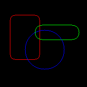

# banglejs-2-drawroundrect #

draws a rounded rectangle on a Bangle.js 2

This module adds a method `drawRoundRect` for drawing rounded rectangles to the global graohics context `g`.



The new method has the signature

```
g.drawRoundRect(x1,y1, x2,y2, radius);
```

with the following parameters:

* `x1` - the left x coordinate
* `y1` - the top y coordinate
* `x2` - the right x coordinate
* `y2` - the bottom y coordinate
* `radius` - the corner radius (limited to 50% of the shorter edge of the rectangle

The rounded rectangle is 1px wide and drawn in the current foreground color.

## License ##

[MIT License](LICENSE.md)
